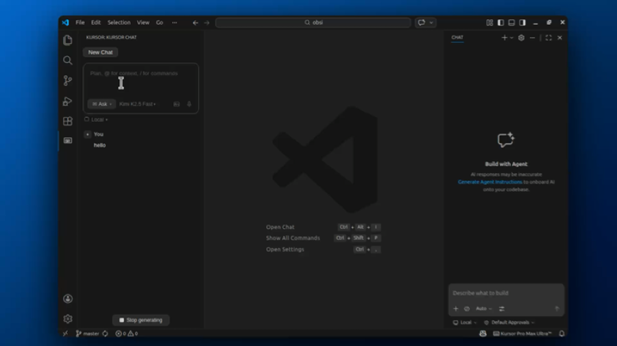

# ⌨️ Kursor

> The AI Code Editor that Cursor wishes it was.

**Kursor** is a free, open-source VSCode extension that brings the full Cursor AI experience — powered by **Kimi (Moonshot AI)**.

Why pay $20/month when you can have **Kursor Pro Max Ultra™**?

## Demo

Click to play:
[](demo/kursor-demo.mp4)

## Kursor vs Cursor

| Feature | Kursor | Cursor |
|---------|--------|--------|
| Price | **Free** | $20/month |
| AI Model | Kimi (your choice) | Whatever they decide |
| Open Source | **Yes** | No |
| Agent Mode | ✅ | ✅ |
| Code Search | ✅ | ✅ |
| File Edit | ✅ | ✅ |
| Terminal | ✅ | ✅ |
| Name Coolness | K > C | — |

## Features

### 🤖 Agent Mode
Kimi can autonomously search your codebase, read files, run commands, and edit code — just like Cursor Agent.

- **searchWorkspace** — Find files by glob pattern or search contents by text
- **readFile** — Read any file in your workspace
- **runCommand** — Execute shell commands (with your approval)
- **editFile** — Create or modify files (with your approval)

Tool calls are displayed as collapsible cards with Accept/Reject buttons for dangerous operations.

### 💬 AI Chat Sidebar
Cursor-style chat panel with streaming responses, Markdown rendering, and syntax-highlighted code blocks.

### ⌨️ Inline Chat
Press `Cmd+Shift+K` (Mac) or `Ctrl+Shift+K` (Windows/Linux) to edit code inline with AI.

### 📝 Smart Context
Automatically includes your current file and selection as context. Use `@file`, `@selection`, `@currentFile` to reference specific context.

### 🔧 Code Block Actions
Every code block in chat has **Copy** and **Insert** buttons to quickly use generated code.

## Installation

### Step 1: Download Kursor

Download the latest `kursor-X.X.X.vsix` from the [Releases page](https://github.com/teee32/kursor/releases).

### Step 2: Install the VSIX

**Option A — VSCode GUI (recommended):**
1. Open VSCode
2. Go to the **Extensions** view (`Cmd+Shift+X`)
3. Click the `···` menu (top-right of the extensions panel)
4. Select **Install from VSIX...**
5. Choose the downloaded `.vsix` file

**Option B — Command line:**
```bash
code --install-extension kursor-0.0.2.vsix
```

### Step 3: Get a Kimi API Key (free)

1. Go to [platform.moonshot.ai](https://platform.moonshot.ai/)
2. Sign up / log in (supports phone number, WeChat, GitHub OAuth)
3. Navigate to **API Keys** in the sidebar
4. Click **Create API Key** → copy the key (starts with `sk-`)
5. Kimi offers free quota on registration — no credit card required

### Step 4: Configure Kursor

1. Open VSCode command palette:
   - **Mac:** `Cmd+Shift+P`
   - **Windows/Linux:** `Ctrl+Shift+P`
2. Type and select **Kursor: Set Kimi API Key**
3. Paste your API key and press `Enter`

### Step 5: Open a Workspace Folder

Agent mode requires an open workspace folder (not just a single file):

1. `Cmd+O` / `Ctrl+O` to open a folder
2. Or drag a folder into VSCode
3. The Kursor sidebar will show "Agent mode requires an open workspace folder" if none is open

### Step 6: Start Chatting!

- **Open Kursor:** Click the **K** icon in the VSCode activity bar (left sidebar)
- **Send a message:** Type in the composer at the top and press `Enter`
- **Agent mode:** Kimi can read files, search code, run commands, and edit files autonomously
- **Ask mode:** Simple question-answering without tool access
- **Switch modes:** Click the **Agent** / **Ask** button in the toolbar
- **Change model:** Click the model name dropdown (top-right of composer) to switch between Kimi models
- **Inline chat:** Press `Cmd+Shift+K` / `Ctrl+Shift+K` for quick inline edits

### Optional: Configure Settings

All settings are available via **File → Preferences → Settings → Extensions → Kursor**:

| Setting | Default | Description |
|---------|---------|-------------|
| `kursor.apiKey` | — | Your Kimi API key |
| `kursor.model` | `moonshot-v1-32k` | AI model to use |
| `kursor.apiBase` | `https://api.moonshot.ai/v1` | API endpoint (change for proxies) |
| `kursor.temperature` | `0.7` | Response creativity, 0 (precise) to 1 (creative) |
| `kursor.agentMaxIterations` | `20` | Max tool call rounds per turn (safety limit) |
| `kursor.commandTimeout` | `30000` | Shell command timeout in milliseconds |

## Supported Models

| Model | Context | Use Case |
|-------|---------|----------|
| `moonshot-v1-8k` | 8K | Quick questions |
| `moonshot-v1-32k` | 32K | General coding (default) |
| `moonshot-v1-128k` | 128K | Large file analysis |
| `kimi-k2.5` | 256K | Latest model, best for Agent mode |

## Development

```bash
git clone https://github.com/teee32/kursor.git
cd kursor
npm install
npm run compile
# Press F5 in VSCode to launch Extension Development Host
```

**To package a new release:**
```bash
npm run package
# Output: kursor-X.X.X.vsix
```

> **Note:** Packaging requires Node 20.18.1+. Run `npm run verify-node` to check.

## Project Structure

```
kursor/
├── src/
│   ├── extension.ts          # Extension entry point
│   ├── api/
│   │   ├── kimi.ts           # Kimi API client (streaming + tool calling)
│   │   └── types.ts          # TypeScript interfaces
│   ├── chat/
│   │   ├── ChatProvider.ts   # Webview provider (Agent/Ask orchestration)
│   │   └── chat.html         # Chat UI (Cursor-style)
│   ├── inline/
│   │   └── InlineProvider.ts # Inline chat (Cmd+Shift+K)
│   ├── agent/
│   │   ├── tools.ts          # Tool definitions (OpenAI function calling format)
│   │   ├── toolExecutor.ts   # Tool execution (search, read, run, edit)
│   │   ├── agentLoop.ts      # Agent conversation loop
│   │   └── agentPrompt.ts    # Agent system prompt
│   └── branding/
│       └── messages.ts       # UI text and satirical messages
├── media/
│   └── icon.svg              # Extension icon
├── package.json
├── tsconfig.json
├── LICENSE
└── CHANGELOG.md
```

## Disclaimer

This is a satirical, educational project. Cursor is a great product — we just think Kimi deserves some love too. No Cursor engineers were harmed in the making of this extension.

## License

[MIT](LICENSE) — Because unlike some editors, we believe in freedom.

---

*Kursor Pro Max Ultra™ — Saving developers $240/year since 2026.*
